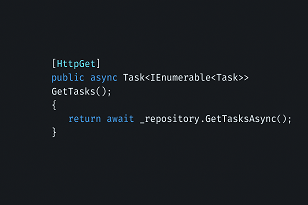

# Exemplos de Texto Formatado em Markdown

## Títulos

- `# Título 1`
- `## Título 2`
- `### Título 3`
- `#### Título 4`
- `##### Título 5`
- `###### Título 6`

## Descrição

- Texto normal pode ser escrito diretamente.
- Para **negrito**, use `**texto**` ou `__texto__`.
- Para *itálico*, use `*texto*` ou `_texto_`.
- Para ~~tachado~~, use `~~texto~~`.

## Listas

### Lista Ordenada

1. Primeiro item
2. Segundo item
3. Terceiro item

### Lista Não Ordenada

- Item 1
- Item 2
- Item 3

## Links

- [Texto do link](URL)

## Imagens



```markdown

```

## Código

### Código em Linha

- Use crase simples: `` `código` ``

### Bloco de Código

- Use três crases:

    ```bash
    git --version
    git version 2.47.1.windows.2
    ```

## Citações

- Use `>` para criar uma citação:
    > Esta é uma citação.

## Tabelas

- Exemplo de tabela:

    ```markdown
    | Cabeçalho 1 | Cabeçalho 2 |
    |-------------|-------------|
    | Linha 1     | Coluna 1    |
    | Linha 2     | Coluna 2    |
    ```

## Linhas Horizontais

- Use três ou mais hífens, asteriscos ou sublinhados:

    ```markdown
    ---
    ***
    ___
    ```

## Listas de Tarefas

- [ ] Tarefa 1
- [x] Tarefa 2
